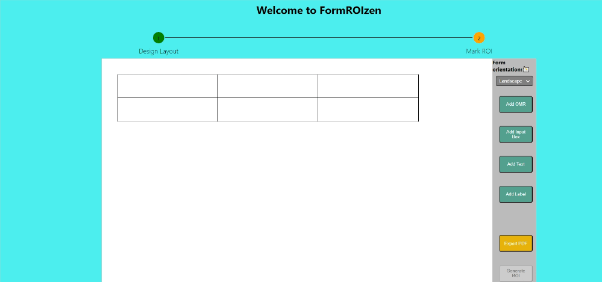

# Sunbird FormROIzen

Project Sunbird FormROIzen aims to revolutionize the process of creating layouts and templates across various industries and generating Sunbird Saral accepting ROIs. With a user-friendly interface and a plethora of customization options, this project simplifies the creation of templates, automates generation of ROIs with minimal user intervention from school attendance sheets to hospitality brochures.

## Table of Contents

- [Introduction](#introduction)
- [Technical Overview](#technical-overview)
- [Getting Started](#getting-started)
- [Features](#features)
- [Demo](#demo)

## Introduction

Project Sunbird FormROIzen addresses the challenges of manual layout design and manual time-consuming ROI generation by offering intuitive tools that empower users to customize and adapt any new Form templates faster and easier. This enhancement results in time and resource savings across diverse sectors.

## Technical Overview

The project is developed using a combination of JavaScript, React, and basic HTML/CSS. The frontend is built with React to ensure a dynamic and responsive user interface. The template creation logic is orchestrated using JavaScript and ReactJS. The auto-ROI marking capability is built using Opencvjs and javascript. The project incorporates various libraries and technologies to streamline template customization, ROI json generation and pdf temeplate download.

## Getting Started

To embark on your Sunbird Saral journey, follow these steps:

1. Clone the repository: `git clone https://github.com/your-username/sunbird-saral.git`
2. Navigate to the project directory: `cd sunbird-saral`
3. Install the necessary dependencies: `npm install`
4. Launch the development server: `npm start`

## Features

- A user-friendly interface simplifying template designing, download and ROI generation.
- Effortless customization of fields within designed templates.
- Flexibility to update, add, or remove fields to tailor templates to specific requirements.
- Generation of finalized templates, available for digital download or printing.
- Versatile customization options catering to different industries and scenarios.
- Automating ROI generation and publishing to Saral backend within few minutes.

## Demo

Upon entering the Main Page, the interface offers a clear view:

Let's delve into a demo of creating a template from scratch. Click on 'Go to toolbox':

Key points to note:

1. The central white canvas is where the primary template is constructed.
2. A small box at the top left corner marks the initial cell of the template.
3. buttons on the right facilitate the addition of various objects.
4. Horizontal and vertical lines while dragging the components to help in alignment .
5. The 'Export PDF' option generates a downloadable PDF of the template.
6. The 'Generate ROI' button gets enabled once you export designed template pdf and navigates user to new screen where he can generate ROIs.

## How It Works

### Step-1: Design Layout:
The template is built using the starting cell. Resize cells by dragging their edges. Add cells by clicking the plus button and specifying direction.

- **Cell Features**

Each cell boasts the following functionalities:

\- Resize to the right or down by dragging edges.
\- Add a new cell of similar size to the right or down.
\- Double-click to edit and add text.
\- Triple-click to modify basic text properties like boldness and text size.

Example:

Let's explore the button options:

- **Add OMR**

Click to insert an OMR filling component. 
Features:
\- Red cross button for removal (on hover).
\- Drag the OMR anywhere on the canvas.
\- Scroll to adjust pixel size.
\- Double Click to open a popup asking to resize and change color of the OMR.

- **Add Input Box**

This creates a horizontal row of input boxes for example IDs, Class, Section, etc. 
Features:
\- Delete button (top right) for component removal.
\- Increase/decrease the number of cells in the row.
\- Scroll to adjust pixel size.
\- Double Click to open a popup asking to resize the width and height of Input Box.

- **Add Free Text**

Create free text components for headlines, instructions, etc. Features:

\- Drag the text field.
\- Double-click to edit text.
\- Triple-click for advanced text options like fontsize , fontweight.

- **Export PDF**

After creating the template, export it as a PDF. Four dots in the corners mark the ROI scanning boundary.

Let's create a simple template:

Post-creation:

Exported PDF:

#### Note 
Embrace the professionalism of Sunbird Saral in your template endeavors!
