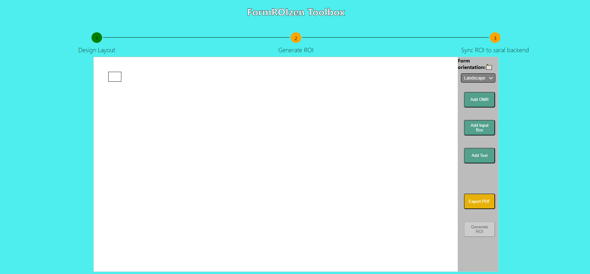

# Sunbird FormROIzen

Project Sunbird FormROIzen aims to revolutionize the process of creating layouts and templates across various industries and generating Sunbird Saral accepting ROIs. With a user-friendly interface and a plethora of customization options, this project simplifies the creation of templates, automates generation of ROIs with minimal user intervention from school attendance sheets to hospitality brochures.

## Table of Contents

- [Introduction](#introduction)
- [Technical Overview](#technical-overview)
- [Tech Stack](#tech-stack)
- [Dependency Softwares to install](#dependency-softwares-to-install)
- [Getting Started](#getting-started)
- [Features](#features)
- [Demo](#demo)

## Introduction

Project Sunbird FormROIzen addresses the challenges of manual layout design and manual time-consuming ROI generation by offering intuitive tools that empower users to customize and adapt any new Form templates faster and easier. This enhancement results in time and resource savings across diverse sectors.

## Technical Overview

The project is developed using a combination of JavaScript, React, and basic HTML/CSS. The frontend is built with React to ensure a dynamic and responsive user interface. The template creation logic is orchestrated using JavaScript and ReactJS. The auto-ROI marking capability is built using Opencvjs and javascript. The project incorporates various libraries and technologies to streamline template customization, ROI json generation and pdf temeplate download.

## Tech Stack

- NodeJs
- ReactJs
- JavaScript
- OpencvJs

## Dependency Softwares to install
- NodeJS (Recommended version v16.9.1 LTS) 
    - Windows: Refer https://nodejs.org/en/blog/release/v16.13.0

    - Linux:
    ```
    cd ~
    curl -sL https://deb.nodesource.com/setup_16.x -o nodesource_setup.sh
    sudo bash nodesource_setup.sh
    sudo apt-get install nodejs
    node -v
    ```
    - After install verify nodejs version is 16 by typing “node -v” in CLI
- Docker
    - After install verify mongodb is properly installed by typing “docker --version” in CLI
- Git
    - After install verify mongodb is properly installed by typing “git --version” in CLI

## Getting Started

### Running locally
1. Clone the repository: `git clone https://github.com/Sunbird-Saral/Saral-Layout-Generator.git`
2. Navigate to the project directory: `cd Saral-Layout-Generator`
3. Install the necessary dependencies: `npm install`
4. Launch the development server: `npm start`

### Run as docker container
1. Clone the repository: `git clone https://github.com/Sunbird-Saral/Saral-Layout-Generator.git`
2. Navigate to the project directory: `cd Saral-Layout-Generator`
3. Build docker: `docker build -f Dockerfile.dev -t sunbird-formroizen:1.0-latest .`
4. Run docker container: `docker run --name sunbird-formroizen -p 3006:3006 -it sunbird-formroizen:1.0-latest`

### Deploy as staging/dev environment on EC2 with docker swarm
1. Clone the repository: `git clone https://github.com/Sunbird-Saral/Saral-Layout-Generator.git`
2. Navigate to the project directory: `cd Saral-Layout-Generator`
3. Build docker: `docker build -f Dockerfile.dev -t sunbird-formroizen:1.0-latest .`
4. Create docker service stack: `docker stack deploy -c docker-compose.dev.yml your_service_name`

## Features

- A user-friendly interface simplifying template designing, download and ROI generation.
- Effortless customization of fields within designed templates.
- Flexibility to update, add, or remove fields to tailor templates to specific requirements.
- Generation of finalized templates, available for digital download or printing.
- Versatile customization options catering to different industries and scenarios.
- Automating ROI generation and publishing to Saral backend within few minutes.

## Demo

Upon entering the Main Page, the interface offers a clear view:


Let's delve into a demo of creating a template from scratch. Click on 'Go to toolbox':
- Toolbox facilitates three step process to allow Saral adapt new form.
  1. Design Layout: Allows user to design form.
  2. Generate ROI: Allows user to auto-mark ROI and generate ROI json file.
  3. Sync ROI to saral backend: Allows user to push generated ROI to Saral backend.



Key points to note:

1. The central white canvas is where the primary template is constructed.
2. A small box at the top left corner marks the initial cell of the template.
3. buttons on the right facilitate the addition of various objects.
4. Horizontal and vertical lines while dragging the components to help in alignment .
5. Select "Form orientation" either as "Landscape" or "Potrait", default is "Landscape".
5. The "Export PDF" option generates a downloadable PDF of the template.
6. The "Generate ROI" button gets enabled once you export designed template pdf and navigates user to new screen where he can generate ROIs.

## How It Works

### Step-1: Design Layout:
The template is built using the starting cell. Resize cells by dragging their edges. Add cells by clicking the plus button and specifying direction.

**Cell Features**
- Each cell boasts the following functionalities:
    - Resize to the right or down by dragging edges.
    - Add a new cell of similar size to the right or down, click '+' symbol by hovering over edges.
    - Delete cell by hovering on top right corner 'X' symbol.

Example:


**Let's explore the button options:**

**Add OMR**
- Click to insert an OMR filling component.
- You will be presented with a popup asking below details which helps system to know the structure of Form being created:
    - Field Name: What Field name(label) in form does this OMR field belongs to.
    - Field Type: OMR
    - Field Length: Defines how many OMR options are required.
    - Field Order: Defines sequence of field in the form.
    - On clicking on Apply, a red message will be shown below "Add OMR" button to indicate how many OMRs needs to be added based on Field Length count defined above.
    
- OMR element features:
    - Red cross button for removal (on hover).
    - Drag the OMR anywhere on the canvas.
    - Mouse scroll to resize.
    - Double Click to open a popup asking to resize and change color of the OMR.
    


**Add Input Box**
- This creates a horizontal row of input boxes for example IDs, Class, Section, etc.
- You will be presented with a popup asking below details which helps system to know the structure of Form being created:
    - Field Name: What Field name(label) in form does this OMR field belongs to.
    - Field Type: Alphabet/Numeric/Alphanumeric
    - Field Length: Defines how many input boxes are required.
    - Field Order: Defines sequence of field in the form.
    - On clicking on Apply, a red message will be shown below "Add Input Box" button to indicate how many Input Boxes needs to be added based on Field Length count defined above.
    
- Input box element features:
    - Delete button (top right) for component removal.
    - Increase/decrease the number of cells in the row.
    - Scroll to adjust pixel size.
    - Double Click to open a popup asking to resize the width and height of Input Box.
    

**Add Text**
- Create free text components for headlines, instructions, etc. Features:
- Text element features:
    - Drag the text field.
    - Double-click to edit text.
    - Triple-click for advanced text options like fontsize , fontweight.
    


**Export PDF**
- After creating the template, export it as a PDF by Clicking on "Export PDF". Four dots in the corners mark the ROI scanning boundary. This will download the PDF file and enables next step "Generate ROI"
- Example:
    
    

### Step-2: Generate ROI:
- This step allows user to generate ROI(Region of Intrest) which later will be uploaded to Saral backend, so that Saral can be used to scan generated form PDF in previous step.

**Below are steps on how to use:**

**Mark Reference ROI**: User needs to let tool know what parts of form he wants to mark by marking initial selection ex: inputbox/OMR.
- Below are steps to do it:
    - Drag the mouse pointer from one corner of the region of interest (ROI) to another to outline it.
    - Release the mouse button to confirm the selection.
    - Press "Mark ROI" to start auto select similar type of ROI marked.
    - Repeat above for each different input box or region of interest until all required areas are marked and automatically selected.

**Review selected ROIs**:
- After marking and auto-selecting all ROIs, review them to ensure accuracy and completeness.
- Below are some of action you can take while reviewing auto-marked ROIs.
    - **Press Delete ROIs**: 
        - If any ROI needs to be removed, press the "Delete ROIs" button.
        - Click on the left corner of the marked box to deselect the ROI.
    
    - **Press Add ROIs**:
        - To add new ROIs, press the "Add ROIs" button.
        - Repeat the process for all required ROI by dragging the mouse pointer from one corner of the region of interest (ROI) to another to outline it.
    
    - **Press Reset ROIs to start over**:
        - If needed, press the "Reset ROIs" button to clear all marked ROIs and start the marking process from the beginning.

    - **Finalize ROI**:
        - Once all required ROIs are marked, reviewed, and adjusted as necessary, finalize the ROI marking process.
        - Click on the "Finish ROI Marking" button to confirm the selection and proceed to the next step.

**Generate ROI Json**:
- After finishing the ROI marking process, click on the appropriate button to generate the ROI data in JSON format.
- This JSON data can then be used for further processing or analysis.

Example:


### Step-3: Sync ROI to saral backend:
- This step allows admin user to dynamically post/sync generated ROI json to saral backend, such that it becomes available for users to scan new forms.

**Below are steps on how to use it:**
- From Generate ROI page click on "Publish to backend" to go to new screen.
- Login to your Saral backend by providing baseUrl(saral backend api server url) userId and password.
- Once login is successful, click on "Post ROI to saral backend" to sync generated ROI to backend


